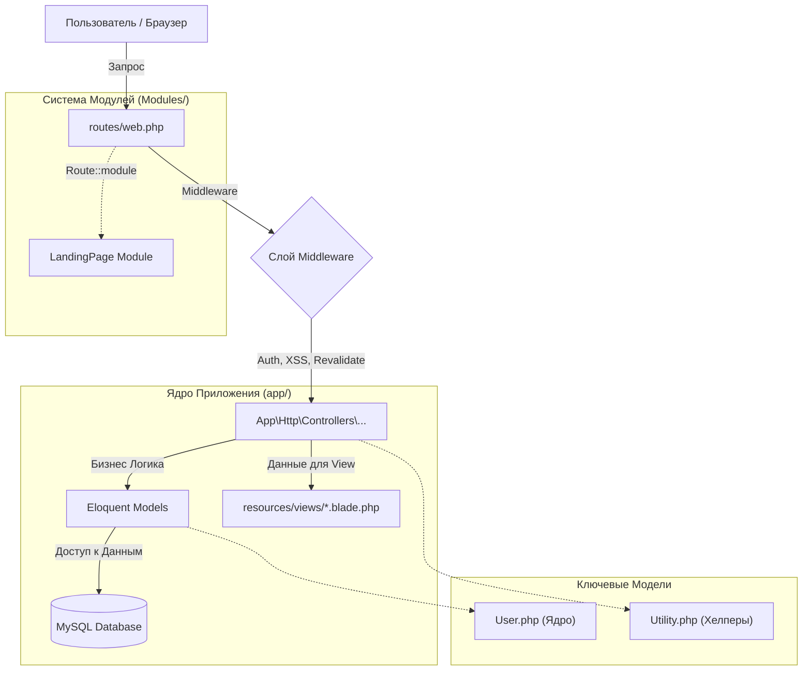

# ERPGo SaaS - Справочник Разработчика

## 🚀 Введение
Добро пожаловать в кодовую базу ERPGo SaaS. Этот гайд написан **разработчиком для разработчика**. В отличие от стандартной документации, которая говорит *как пользоваться* софтом, этот гайд объясняет, *как он работает* под капотом, чтобы ты мог эффективно его менять, расширять и дебажить.

**Сводка по Архитектуре:**
*   **Тип:** Монолитное приложение Laravel с модульными возможностями.
*   **Фреймворк:** Laravel 11.x
*   **Фронтенд:** Blade Templates + Tailwind CSS + Vanilla JS/jQuery.
*   **База данных:** MySQL.
*   **Ключевой паттерн:** MVC (Model-View-Controller).
*   **Мульти-тенантность:** Единая БД, разделение по колонкам (`created_by` field).

---

## 🗺️ Высокоуровневая Архитектура

Приложение следует традиционному жизненному циклу запроса Laravel, но с сильной зависимостью от "God Model" (`User`) и огромного файла роутинга.



---

## 📂 Разбор Структуры Проекта

Вот "Ментальная Карта", необходимая для навигации по файлам:

### 1. Ядро (`app/`)
Здесь живет 95% логики.
*   **`Http/Controllers/`**: Содержит 160+ контроллеров. Большинство — стандартный CRUD.
    *   *Ключевые контроллеры*: `DashboardController`, `UserController`, `InvoiceController`.
*   **`Models/`**: 195+ Моделей.
    *   🚨 **`User.php`**: Это самый критичный файл. Он обрабатывает авторизацию, роли, планы и даже форматирование. В нем 4000+ строк. **Изучи его первым.**
    *   **`Utility.php`**: Массивный класс-хелпер со статическими методами для настроек, email, хранилища и т.д.
*   **`Traits/`**: Переиспользуемая логика. Проверь `CanOffer.php` или подобные, если они есть (часто встречается в стиле этого разработчика).

### 2. Модули (`Modules/`)
Использует `nwidart/laravel-modules`.
*   На данный момент модулем является только **`LandingPage`**.
*   Если хочешь добавить *новую* большую фичу (например, "HelpDesk"), создавай её здесь, чтобы не засорять ядро.

### 3. Фронтенд (`resources/`)
*   **`views/`**: 700+ Blade файлов.
    *   `layouts/`: Мастер-шаблоны (`admin.blade.php`, `auth.blade.php`).
    *   `partials/`: Переиспользуемые куски (сайдбар, хедер).
*   **`assets/`**: Процесс сборки использует Vite.

---

## 🔍 Глубокое Погружение: Ключевые Концепции

### 1. Мульти-Тенантность (Часть "SaaS")
Система использует **Single Database Multi-Tenancy**.
*   **Концепт**: Все юзеры делят одни и те же таблицы.
*   **Разделение**: Колонка `created_by` почти в каждой таблице связывает данные с "Компанией" (User).
*   **Логика**:
    *   Когда Юзер логинится, система проверяет его `type`.
    *   Если он `company`, он видит свои данные.
    *   Если он `employee`, код часто проверяет `Auth::user()->creatorId()`, чтобы найти ID Компании и отфильтровать данные по нему.

**Пример Кода (Концептуальный):**
```php
// В Контроллере
$invoices = Invoice::where('created_by', \Auth::user()->creatorId())->get();
```

### 2. Хелпер "Utility"
Вместо использования конфигов Laravel `config()` для всего, это приложение хранит динамические настройки (лого, цвета, ключи платежек) в базе данных и достает их через класс `Utility`.
*   **Плюсы**: Админы могут менять настройки без редеплоя.
*   **Минусы**: Может быть медленнее, если не кэшировать; усложняет тестирование кода.

### 3. Платежные Шлюзы
Файл `routes/web.php` забит роутами платежек.
*   **Паттерн**: `Route::post('/invoice-pay-with-paypal', ...)`
*   **Контроллер**: У каждого шлюза свой контроллер (напр. `PaypalController`, `StripePaymentController`).
*   **Поток**:
    1.  Юзер жмет "Pay" -> Роут бьет в Контроллер.
    2.  Контроллер инициализирует Шлюз (используя ключи из `Utility`).
    3.  Редиректит юзера на Провайдера Платежей.
    4.  Callback роут обрабатывает ответ и обновляет статус `Invoice`.

---

## 🛠️ Советы Разработчику

*   **Дебаггинг**: Так как `User.php` огромный, `dd($user)` может быть перебором. Используй `dd($user->toArray())` или инспектируй конкретные атрибуты.
*   **Производительность**: Следи за N+1 запросами. Код использует много связей. Установи "Laravel Debugbar" немедленно, если его нет.
*   **Расширение**:
    *   **Мелкое изменение**: Правь Контроллер/View напрямую.
    *   **Новая Фича**: **НЕ** захламляй `app/`. Создай новый Модуль в `Modules/MyNewFeature`. Это держит твой код отдельно от "спагетти" основного приложения.

## ⚠️ Красные Флаги / Технический Долг
*   **Размер `User.php`**: Он нарушает Single Responsibility Principle. Будь осторожен, когда правишь его.
*   **Прямые запросы в БД**: Ты можешь найти сырой SQL или тяжелую логику во View. Выноси это в Сервисы или Scopes, когда находишь.
*   **Файл Роутов**: Он слишком большой. Если добавляешь много роутов, подумай о разделении `web.php` на файлы поменьше и их подключении.

---


